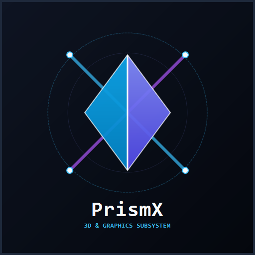
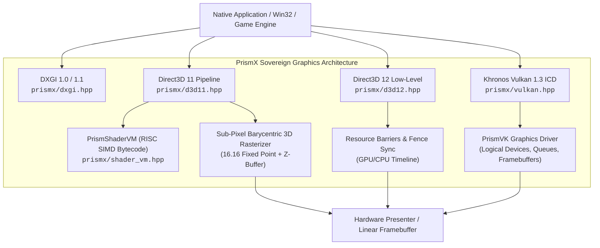

# PrismX: Sovereign Graphics Architecture

<p align="center">
  
</p>

[](https://github.com/MicaNT-Kernel/PrismX/actions/workflows/ci.yml)
[](https://en.cppreference.com/w/cpp/23)
[](LICENSE)
[](docs/CLEAN_ROOM_PROVENANCE.md)
[](#clean-room-guarantees)
[](https://micant.barrersoftware.com)

**PrismX** is an independent, sovereign graphics architecture providing unified clean-room compatibility with **DirectX** (DXGI 1.0/1.1, Direct3D 11, Direct3D 12) and **Khronos Vulkan 1.3** in pure modern ISO C++23.

Engineered with **zero proprietary code**, **zero external runtime dependencies**, and **zero telemetry**, PrismX serves as both the native graphics executive for [MicaNT](https://github.com/MicaNT-Kernel/MicaNT) and a standalone cross-platform software rasterization & driver engine.

---

> *"The PRISM architecture was designed to be clean, elegant, and fast. In software engineering, when you strip away the legacy cruft and build strictly to first principles, speed and reliability follow naturally."*
> — Tribute to Dave Cutler's 1988 DEC PRISM RISC project

---

## Architecture Overview



---

## Key Subsystems

### 1. DXGI 1.0 / 1.1 Presentation Infrastructure (`prismx/dxgi.hpp`)
- **Factory & Enumeration**: `CreateDXGIFactory`, `CreateDXGIFactory1`, `IDXGIFactory1`.
- **Adapters & Displays**: Hardware and software WARP adapters, output mode lists (`1920x1080`, `1280x720`, `1024x768`), and VBlank synchronizers.
- **Swap Chains**: Double and triple buffering with flip discard (`DXGI_SWAP_EFFECT_FLIP_DISCARD`) and blit presentation.

### 2. Direct3D 11 Immediate Pipeline (`prismx/d3d11.hpp`)
- **Pipeline States**: Viewports, Scissor rectangles, Input Layouts, Constant Buffers, RenderTargetViews (RTV), DepthStencilViews (DSV).
- **3D Mathematics Engine**: `Vector3`, `Vector4`, `Matrix4x4`, `MatrixMultiply`, `MatrixPerspectiveFovLH`, `MatrixLookAtLH`, `MatrixRotationX/Y/Z`, `MatrixTranslation`.
- **Software Rasterizer**: Sub-pixel precision (16.16 fixed point), perspective-correct barycentric attribute interpolation, depth testing (Z-buffer), wireframe/solid fill, and indexed primitive rendering (`DrawIndexed`).

### 3. Direct3D 12 Low-Level Explicit Pipeline (`prismx/d3d12.hpp`)
- **Explicit GPU Control**: `ID3D12Device`, `ID3D12CommandQueue`, `ID3D12CommandAllocator`, `ID3D12GraphicsCommandList`.
- **Resource Barriers**: Explicit subresource state tracking (`D3D12_RESOURCE_BARRIER_TYPE_TRANSITION`, `PRESENT` ↔ `RENDER_TARGET`).
- **Descriptor Heaps**: RTV, DSV, and CBV/SRV/UAV descriptor heap allocators.
- **Timeline Fences**: Asynchronous GPU/CPU timeline fence synchronization (`Signal`, `GetCompletedValue`).

### 4. PrismShaderVM Programmable Bytecode Engine (`prismx/shader_vm.hpp`)
- **RISC SIMD 4-Channel Vector Engine**: 16 opcodes (`MOV`, `ADD`, `SUB`, `MUL`, `MAD`, `DP3`, `DP4`, `MIN`, `MAX`, `SLT`, `SGE`, `RCP`, `RSQ`, `CLAMP`, `TEX`, `RET`).
- **Register Architecture**: 8 Temporary working registers (`r0`–`r7`), 4 Input attribute registers (`v0`–`v3`), 16 Constant registers (`c0`–`c15`), and 2 Output registers (`o0`–`o1`).
- **Built-in Shaders**: Standard MVP Matrix Transformation Vertex Shader, Textured Modulation Pixel Shader, and Directional Lambertian Lighting Pixel Shader.

### 5. Khronos Vulkan 1.3 ICD Loader & PrismVK (`prismx/vulkan.hpp`)
- **ICD Architecture**: Khronos standard dispatch table and function pointer resolution (`vkGetInstanceProcAddr`, `vkGetDeviceProcAddr`).
- **Core Entities**: `VkInstance`, `VkPhysicalDevice`, `VkDevice`, `VkQueue`, `VkCommandBuffer`, `VkRenderPass`, `VkFramebuffer`, `VkSwapchainKHR`.
- **PrismVK Driver**: Sovereign software graphics driver implementing physical device properties, memory types, and command queue execution.

### 6. DirectX 12 Raytracing (DXR) & Mesh Shaders (`prismx/d3d12raytracing.hpp`, `prismx/dxr.hpp`)
- **DirectX 12 Ultimate Parity**: `ID3D12Device5`, `ID3D12GraphicsCommandList4`, `ID3D12GraphicsCommandList6`, `ID3D12StateObject`, `ID3D12StateObjectProperties`.
- **Hardware Tiers**: Full DXR Tier 1.1 (`D3D12_RAYTRACING_TIER_1_1`) and Mesh Shader Tier 1 (`D3D12_MESH_SHADER_TIER_1`) feature queries.
- **Acceleration Structures**: Top-Level (TLAS) and Bottom-Level (BLAS) prebuild size computation and hardware/software construction.
- **Intersection Engine**: Clean-room Möller-Trumbore ray-triangle intersection solver simulating primary rays via `DispatchRays`.
- **Mesh Shader Amplification**: Next-generation geometry pipeline amplifying threadgroups into meshlet primitives via `DispatchMesh`.

### 7. DirectStorage & GPU Decompression Pipeline (`prismx/dstorage.hpp`)
- **DirectStorage 1.2 Architecture**: `IDStorageFactory`, `IDStorageQueue`, `IDStorageFile`, `IDStorageStatusArray`, `IDStorageCustomDecompressionQueue`.
- **NVMe Storage Bypass**: Asynchronous storage request pipeline bypassing OS file system abstractions and CPU caching bottlenecks.
- **Direct GPU Routing**: Direct memory copy into Direct3D 12 buffer and texture subresources (`ID3D12Resource`).
- **Parallel Decompression Codecs**: Clean-room GDeflate (`DSTORAGE_COMPRESSION_FORMAT_GDEFLATE`), Zlib, and raw stream uncompressed pipelines.
- **Status & Timeline Fences**: Atomic status array notification tokens and asynchronous `ID3D12Fence` signal synchronization.

---

## Clean-Room Guarantees

| Guarantee | Metric | Detail |
| :--- | :--- | :--- |
| **Dependencies** | **0** | Pure ISO C++23 standard library only (`<vector>`, `<memory>`, `<atomic>`, `<cmath>`, etc.). |
| **Footprint** | **< 64 KB** | Header-only interface; zero background service overhead. |
| **Binary Size** | **~100 KB** | Standalone demos compile to ~95KB to 150KB binaries. |
| **Telemetry** | **0%** | Completely sovereign; zero tracking, zero telemetry, zero analytics. |
| **IP Provenance** | **100% Clean** | Clean-room developed against MIT-licensed DirectX-Headers and Khronos open specs. |

---

## Quickstart

### Include Single Umbrella Header

```cpp
#include <prismx.hpp>

using namespace prismx;

int main() {
    // 1. Create DXGI Factory & Direct3D 12 Device
    ComPtr<ID3D12Device> device;
    D3D12CreateDevice(nullptr, D3D_FEATURE_LEVEL_12_0, IID_ID3D12Device, device.PutVoid());

    // 2. Create Command Queue & Allocator
    D3D12_COMMAND_QUEUE_DESC qDesc{ D3D12_COMMAND_LIST_TYPE_DIRECT };
    ComPtr<ID3D12CommandQueue> queue;
    device->CreateCommandQueue(&qDesc, IID_ID3D12CommandQueue, queue.PutVoid());

    // 3. Create Timeline Fence
    ComPtr<ID3D12Fence> fence;
    device->CreateFence(0, D3D12_FENCE_FLAG_NONE, IID_ID3D12Fence, fence.PutVoid());

    queue->Signal(fence.Get(), 1);
    return 0;
}
```

---

## Building & Testing

PrismX uses standard CMake (3.25+) and requires a C++23 compliant compiler (MSVC 19.38+, Clang 17+, or GCC 13+).

```bash
# Clone the repository
git clone https://github.com/MicaNT-Kernel/PrismX.git
cd PrismX

# Configure build
cmake -B build -DCMAKE_BUILD_TYPE=Release

# Build test runner and example binaries
cmake --build build --config Release

# Run test suite
ctest --test-dir build --output-on-failure
```

### Running Examples

```bash
# Direct3D 11 3D Colored Cube with Software Rasterizer
./build/bin/prismx_cube_demo

# Direct3D 12 Explicit Barriers and Fence Sync
./build/bin/prismx_d3d12_demo

# Programmable Shader Bytecode VM
./build/bin/prismx_shader_vm_demo

# Khronos Vulkan 1.3 ICD Driver Query
./build/bin/prismx_vulkan_demo
```

---

## License & Provenance

Licensed under the **MIT License**. See [LICENSE](LICENSE) for full details.

For clean-room engineering provenance, see [CLEAN_ROOM_PROVENANCE.md](docs/CLEAN_ROOM_PROVENANCE.md).
DirectX, Direct3D, and DXGI are registered trademarks of Microsoft Corporation. Vulkan is a registered trademark of Khronos Group Inc. Nominative fair use applies.
