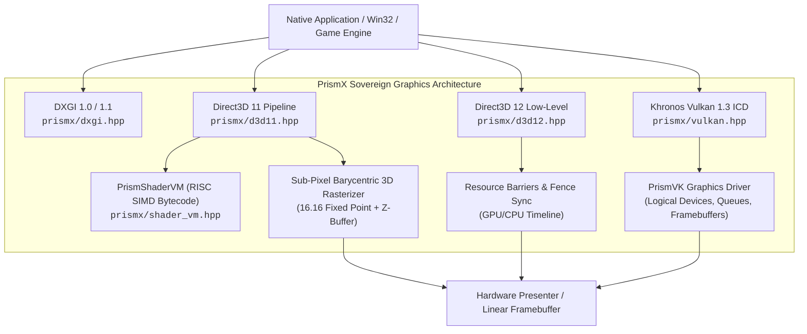

# PrismX: Sovereign Graphics Architecture

<p align="center">
  
</p>

[](https://github.com/MicaNT-Kernel/PrismX/actions/workflows/ci.yml)
[](https://en.cppreference.com/w/cpp/23)
[](LICENSE)
[](docs/CLEAN_ROOM_PROVENANCE.md)
[](#clean-room-guarantees)
[](https://micant.barrersoftware.com)

**PrismX** is an independent, sovereign graphics architecture providing unified clean-room compatibility with **DirectX** (DXGI 1.0/1.1, Direct3D 11, Direct3D 12) and **Khronos Vulkan 1.3** in pure modern ISO C++23.

Engineered with **zero proprietary code**, **zero external runtime dependencies**, and **zero telemetry**, PrismX serves as both the native graphics executive for [MicaNT](https://github.com/MicaNT-Kernel/MicaNT) and a standalone cross-platform software rasterization & driver engine.

---

> *"The PRISM architecture was designed to be clean, elegant, and fast. In software engineering, when you strip away the legacy cruft and build strictly to first principles, speed and reliability follow naturally."*
> — Tribute to Dave Cutler's 1988 DEC PRISM RISC project

---

## Architecture Overview



---

## Key Subsystems

### 1. DXGI 1.0 / 1.1 Presentation Infrastructure (`prismx/dxgi.hpp`)
- **Factory & Enumeration**: `CreateDXGIFactory`, `CreateDXGIFactory1`, `IDXGIFactory1`.
- **Adapters & Displays**: Hardware and software WARP adapters, output mode lists (`1920x1080`, `1280x720`, `1024x768`), and VBlank synchronizers.
- **Swap Chains**: Double and triple buffering with flip discard (`DXGI_SWAP_EFFECT_FLIP_DISCARD`) and blit presentation.

### 2. Direct3D 11 Immediate Pipeline (`prismx/d3d11.hpp`)
- **Pipeline States**: Viewports, Scissor rectangles, Input Layouts, Constant Buffers, RenderTargetViews (RTV), DepthStencilViews (DSV).
- **3D Mathematics Engine**: `Vector3`, `Vector4`, `Matrix4x4`, `MatrixMultiply`, `MatrixPerspectiveFovLH`, `MatrixLookAtLH`, `MatrixRotationX/Y/Z`, `MatrixTranslation`.
- **Software Rasterizer**: Sub-pixel precision (16.16 fixed point), perspective-correct barycentric attribute interpolation, depth testing (Z-buffer), wireframe/solid fill, and indexed primitive rendering (`DrawIndexed`).

### 3. Direct3D 12 Low-Level Explicit Pipeline (`prismx/d3d12.hpp`)
- **Explicit GPU Control**: `ID3D12Device`, `ID3D12CommandQueue`, `ID3D12CommandAllocator`, `ID3D12GraphicsCommandList`.
- **Resource Barriers**: Explicit subresource state tracking (`D3D12_RESOURCE_BARRIER_TYPE_TRANSITION`, `PRESENT` ↔ `RENDER_TARGET`).
- **Descriptor Heaps**: RTV, DSV, and CBV/SRV/UAV descriptor heap allocators.
- **Timeline Fences**: Asynchronous GPU/CPU timeline fence synchronization (`Signal`, `GetCompletedValue`).

### 4. PrismShaderVM Programmable Bytecode Engine (`prismx/shader_vm.hpp`)
- **RISC SIMD 4-Channel Vector Engine**: 16 opcodes (`MOV`, `ADD`, `SUB`, `MUL`, `MAD`, `DP3`, `DP4`, `MIN`, `MAX`, `SLT`, `SGE`, `RCP`, `RSQ`, `CLAMP`, `TEX`, `RET`).
- **Register Architecture**: 8 Temporary working registers (`r0`–`r7`), 4 Input attribute registers (`v0`–`v3`), 16 Constant registers (`c0`–`c15`), and 2 Output registers (`o0`–`o1`).
- **Built-in Shaders**: Standard MVP Matrix Transformation Vertex Shader, Textured Modulation Pixel Shader, and Directional Lambertian Lighting Pixel Shader.

### 5. Khronos Vulkan 1.3 ICD Loader & PrismVK (`prismx/vulkan.hpp`)
- **ICD Architecture**: Khronos standard dispatch table and function pointer resolution (`vkGetInstanceProcAddr`, `vkGetDeviceProcAddr`).
- **Core Entities**: `VkInstance`, `VkPhysicalDevice`, `VkDevice`, `VkQueue`, `VkCommandBuffer`, `VkRenderPass`, `VkFramebuffer`, `VkSwapchainKHR`.
- **PrismVK Driver**: Sovereign software graphics driver implementing physical device properties, memory types, and command queue execution.

### 6. DirectX 12 Raytracing (DXR) & Mesh Shaders (`prismx/d3d12raytracing.hpp`, `prismx/dxr.hpp`)
- **DirectX 12 Ultimate Parity**: `ID3D12Device5`, `ID3D12GraphicsCommandList4`, `ID3D12GraphicsCommandList6`, `ID3D12StateObject`, `ID3D12StateObjectProperties`.
- **Hardware Tiers**: Full DXR Tier 1.1 (`D3D12_RAYTRACING_TIER_1_1`) and Mesh Shader Tier 1 (`D3D12_MESH_SHADER_TIER_1`) feature queries.
- **Acceleration Structures**: Top-Level (TLAS) and Bottom-Level (BLAS) prebuild size computation and hardware/software construction.
- **Intersection Engine**: Clean-room Möller-Trumbore ray-triangle intersection solver simulating primary rays via `DispatchRays`.
- **Mesh Shader Amplification**: Next-generation geometry pipeline amplifying threadgroups into meshlet primitives via `DispatchMesh`.

### 7. DirectStorage & GPU Decompression Pipeline (`prismx/dstorage.hpp`)
- **DirectStorage 1.2 Architecture**: `IDStorageFactory`, `IDStorageQueue`, `IDStorageFile`, `IDStorageStatusArray`, `IDStorageCustomDecompressionQueue`.
- **NVMe Storage Bypass**: Asynchronous storage request pipeline bypassing OS file system abstractions and CPU caching bottlenecks.
- **Direct GPU Routing**: Direct memory copy into Direct3D 12 buffer and texture subresources (`ID3D12Resource`).
- **Parallel Decompression Codecs**: Clean-room GDeflate (`DSTORAGE_COMPRESSION_FORMAT_GDEFLATE`), Zlib, and raw stream uncompressed pipelines.
- **Status & Timeline Fences**: Atomic status array notification tokens and asynchronous `ID3D12Fence` signal synchronization.

### 8. DXCore Modern Adapter Enumeration (`prismx/dxcore.hpp`)
- **Modern Device Discovery**: `IDXCoreAdapterFactory`, `IDXCoreAdapterList`, `IDXCoreAdapter`.
- **Low-Overhead Compute Enumeration**: Lightweight GPU/NPU enumeration decoupled from DXGI desktop swapchains, ideal for headless AI and compute workloads.
- **Hardware Telemetry**: Query dedicated video memory, driver versions, LUIDs, hardware IDs, preemption granularities, and memory budgets.
- **Preference Sorting & Filtering**: Filter adapters by D3D12 graphics, core compute, or WSL attributes; sort by HighPerformance or MinimumPower.

### 9. DirectML Machine Learning & Tensor Execution Pipeline (`prismx/directml.hpp`)
- **DirectML Architecture**: `IDMLDevice`, `IDMLDevice1`, `IDMLOperator`, `IDMLCompiledOperator`, `IDMLBindingTable`, `IDMLCommandRecorder`.
- **Direct3D 12 Integration**: Binds tensor inputs/outputs directly to Direct3D 12 buffers (`ID3D12Resource`) with zero CPU-GPU copy penalties.
- **Comprehensive Tensor Operator Set**:
  - **GEMM**: General Matrix Multiplication ($Y = \alpha AB + \beta C$) with transpositions and fused activations.
  - **ReLU**: Rectified linear unit activation ($Y = \max(0, X)$).
  - **Softmax**: Numerically stable normalized exponential distributions.
  - **2D Spatial Convolution**: Multi-channel convolution with kernel strides, padding, dilations, and bias.
  - **Batch Normalization**: Spatial channel normalization with scaling and shifting ($Y = \frac{X - \mu}{\sqrt{\sigma^2 + \epsilon}} \gamma + \beta$).
  - **Element-Wise Math**: High-speed addition and multiplication tensor passes.

### 10. DirectComposition Modern Compositor Subsystem (`prismx/dcomp.hpp`)
- **DirectComposition Architecture**: `IDCompositionDevice`, `IDCompositionDevice2`, `IDCompositionTarget`, `IDCompositionVisual`, `IDCompositionVisual2`, `IDCompositionSurface`, `IDCompositionAnimation`.
- **Hardware-Accelerated Visual Trees**: Hierarchical visuals with Z-ordering, opacity layers, clipping bounds (rectangles & rounded corners), and affine transforms.
- **Parametric Animation Engine**: Smooth animation curves with cubic bezier polynomials, sinusoidal oscillations, repeats, and direct binding to visual properties.
- **Composition Surfaces & Targets**: Low-latency rendering surfaces (`BeginDraw`/`EndDraw`) and HWND target binding with synchronized multi-target `Commit()` pipelines.

### 11. PrismComposition & Modern Visual Layer Subsystem (`prismx/uicomposition.hpp`)
- **Modern Scene-Graph Visual Layer**: `ICompositor`, `IVisual`, `IContainerVisual`, `ISpriteVisual`, `IVisualCollection`.
- **Dual WinRT Compatibility Projection**: Clean-room implementation backing both `Windows.UI.Composition` and `Microsoft.UI.Composition` activation factories.
- **High-Performance Composition Brushes**: `ICompositionColorBrush`, `ICompositionSurfaceBrush` (alignment & stretch modes), and `ICompositionEffectBrush` (Mica & Acrylic blur effects).
- **KeyFrame & Expression Animations**: Smooth cubic hermite keyframe animations (`IScalarKeyFrameAnimation`, `IVector3KeyFrameAnimation`) and dynamic mathematical expression evaluation (`IExpressionAnimation`, e.g. `Lerp(A, B, Progress)`).
- **Dynamic Property Sets**: Animated property maps (`ICompositionPropertySet`) for reactive UI bindings.

### 12. PrismColor & Advanced Color Subsystem (WCS / HDR) (`prismx/color_system.hpp`)
- **Color Spaces & Wide Gamuts**: Full support for sRGB, scRGB, AdobeRGB (1998), DCI-P3 / Display P3, and ITU-R BT.2020.
- **Colorimetry & Perceptual Spaces**: CIE 1931 XYZ, CIE 1976 Lab, and $\Delta E_{76}$ perceptual difference calculation.
- **Electro-Optical Transfer Functions (EOTF)**:
  - Piecewise sRGB transfer curve.
  - SMPTE ST 2084 Perceptual Quantizer (PQ) supporting 0 to 10,000 Nits high dynamic range.
  - ARIB STD-B67 Hybrid Log-Gamma (HLG) relative scene luminance curve.
- **ACES Film Tone Mapping**: ACES film curve operator for real-time luminance compression of HDR content onto SDR displays.
- **ICC v4.3 Profile Management**: Clean-room parser and validator for ICC.1:2010 profile headers (`'acsp'`), chromaticities, and profile connection spaces.
- **Sovereign COM Interfaces**: `IPrismColorProfile`, `IPrismColorTransform`, `IPrismColorManager` for color conversion and fast 32-bit RGBA bitmap translation.

### 13. PrismInput & Multi-Touch Gesture / Inking Subsystem (`prismx/pointer_input.hpp`)
- **Unified Pointer Input Modeling**: `PointerPoint`, `PointerDeviceType` (Mouse, Touch, Pen, Touchpad), and `PointerButtonState` with sub-pixel contact rects.
- **Multi-Touch Gesture Recognizer**: High-precision recognition pipeline for Tap, Double Tap, Long Press / Hold, Drag / Pan (with velocity tracking), Dual-Contact Pinch-to-Zoom (dynamic scale factor), Dual-Contact Rotation (angular displacement), and High-Velocity Swipes.
- **Stylus Inking & GPU Tessellation Engine**:
  - `InkStroke` with raw digitizer packet ingestion (pressure, tilt, timestamp).
  - Catmull-Rom cubic spline interpolation eliminating digitizer stair-stepping.
  - Calibrated non-linear pressure curves (Linear, Soft, Hard, Sigmoid) with velocity-modulated stroke width.
  - Real-time tessellation into GPU triangle strips ready for Direct3D 11/12 vertex buffers or DirectComposition surfaces.

### 14. Sovereign 2D Vector & TrueType/OpenType Font Tessellation Subsystem (`prismx/vector_font.hpp`)
- **High-Precision 2D Vector Geometry**: `Point2D`, `Rect2D`, and affine `Matrix3x2F` (translation, rotation around center, non-uniform scaling, inversion, point transformation).
- **W3C SVG 1.1 Path Syntax Parser**: Parses complex `d="..."` path strings supporting `M/m`, `L/l`, `H/h`, `V/v`, `C/c`, `S/s`, `Q/q`, `T/t`, `A/a`, and `Z/z` commands with compact float tokenization.
- **Adaptive Curve Subdivision & Arc Parameterization**: De Casteljau subdivision for Quadratic and Cubic Bézier curves based on flatness tolerances, plus center-parameterized elliptical arc discretization.
- **Robust Ear-Clipping Triangulation Engine**:
  - High-performance ear-clipping triangulation for simple and complex polygons.
  - Hole-merging bridge edge insertion transforming multi-contour polygons with inner holes into single simple polygons.
  - Collinear vertex pruning and positive-cross fallback ensuring robust triangulation without degenerate vertex stalls.
- **Dynamic Stroke Expansion**: Polyline stroke expansion with configurable stroke widths, line joins (`Miter`, `Bevel`, `Round`), line caps (`Flat`, `Square`, `Round`), and miter limits.
- **Built-in Sovereign Vector Typeface**: Zero-dependency, in-memory geometric font engine synthesizing vector glyphs for ASCII 32–126 with precise typographic metrics (Ascender: 800, Descender: -200, EmSize: 1000).
- **Signed Distance Field (SDF / MSDF) Rasterizer**: Computes signed Euclidean distance fields from vector paths into 32-bit RGBA distance maps for infinite-resolution GPU text rendering.
- **Text Layout & Paragraph Formatting Engine**: Multi-line paragraph formatting with configurable font sizes, line heights, letter spacing, alignments (`Left`, `Center`, `Right`), and unified vertex/index mesh generation.
- **Sovereign COM Interfaces**: `IPrismVectorPath`, `IPrismFont`, `IPrismTessellator`, `IPrismTextLayout` with factory functions (`CreatePrismVectorPath`, `CreatePrismFont`, `CreatePrismTessellator`, `CreatePrismTextLayout`).

### 15. Sovereign Stateful 2D Canvas & Vector Renderer (`prismx/canvas2d.hpp`)
- **Immediate-Mode 2D Drawing Context**: High-performance stateful drawing context (`IPrismCanvas2D`) following modern Canvas/Skia immediate-mode rendering conventions.
- **Transformation State Stack**: Full affine matrix transform stack with `Save()`, `Restore()`, `Translate()`, `Scale()`, `Rotate()`, `Transform()`, and `SetTransform()`.
- **Comprehensive Porter-Duff & Advanced Blend Modes**: 16 alpha compositing and color blending modes including `SourceOver`, `DestinationOver`, `SourceIn`, `DestinationIn`, `SourceOut`, `DestinationOut`, `SourceAtop`, `DestinationAtop`, `XOR`, `Lighter`, `Multiply`, `Screen`, `Darken`, and `Lighten`.
- **Multi-Stop Gradient & Pattern Shaders**:
  - `LinearGradientBrush`: Arbitrary start/end points with normalized color stops and wrap modes (`Clamp`, `Repeat`, `Reflect`).
  - `RadialGradientBrush`: Dual concentric/eccentric focal circles with smooth color interpolation.
  - `ConicGradientBrush`: Angular sweep gradient around a focal center point.
  - `PatternBrush`: 2D image texture sampling with bilinear filtering and wrapping modes.
- **Vector Path Operations**: Full path geometry construction (`BeginPath`, `ClosePath`, `MoveTo`, `LineTo`, `QuadraticCurveTo`, `BezierCurveTo`, `Arc`, `Ellipse`, `Rect`, `RoundRect`) with `Fill()`, `Stroke()`, and `Clip()` path masking.
- **Subpixel Anti-Aliased Software Rasterizer**: Barycentric triangle rasterizer with 2x2 subpixel supersampling coverage for smooth polygon and stroke rendering.
- **Bitmap Resampling & Manipulation**: Fast bilinear image blitting (`DrawImage`), sub-rectangle source-destination scaling, and direct pixel buffer manipulation (`GetImageData`, `PutImageData`).
- **Typography & Font Layout Integration**: Native vector text measurement (`MeasureText`) and anti-aliased text rendering (`FillText`, `StrokeText`) integrated with `BuiltinTypeface` and `TextLayoutEngine`.
- **Sovereign COM Interfaces**: `IPrismBrush`, `IPrismCanvas2D`, `IPrismCanvasDevice` with factory entry points (`PrismCreateCanvas2D`, `PrismCreateCanvasDevice`).

---

## Clean-Room Guarantees

| Guarantee | Metric | Detail |
| :--- | :--- | :--- |
| **Dependencies** | **0** | Pure ISO C++23 standard library only (`<vector>`, `<memory>`, `<atomic>`, `<cmath>`, etc.). |
| **Footprint** | **< 64 KB** | Header-only interface; zero background service overhead. |
| **Binary Size** | **~100 KB** | Standalone demos compile to ~95KB to 150KB binaries. |
| **Telemetry** | **0%** | Completely sovereign; zero tracking, zero telemetry, zero analytics. |
| **IP Provenance** | **100% Clean** | Clean-room developed against MIT-licensed DirectX-Headers and Khronos open specs. |

---

## Quickstart

### Include Single Umbrella Header

```cpp
#include <prismx.hpp>

using namespace prismx;

int main() {
    // 1. Create DXGI Factory & Direct3D 12 Device
    ComPtr<ID3D12Device> device;
    D3D12CreateDevice(nullptr, D3D_FEATURE_LEVEL_12_0, IID_ID3D12Device, device.PutVoid());

    // 2. Create Command Queue & Allocator
    D3D12_COMMAND_QUEUE_DESC qDesc{ D3D12_COMMAND_LIST_TYPE_DIRECT };
    ComPtr<ID3D12CommandQueue> queue;
    device->CreateCommandQueue(&qDesc, IID_ID3D12CommandQueue, queue.PutVoid());

    // 3. Create Timeline Fence
    ComPtr<ID3D12Fence> fence;
    device->CreateFence(0, D3D12_FENCE_FLAG_NONE, IID_ID3D12Fence, fence.PutVoid());

    queue->Signal(fence.Get(), 1);
    return 0;
}
```

---

## Building & Testing

PrismX uses standard CMake (3.25+) and requires a C++23 compliant compiler (MSVC 19.38+, Clang 17+, or GCC 13+).

```bash
# Clone the repository
git clone https://github.com/MicaNT-Kernel/PrismX.git
cd PrismX

# Configure build
cmake -B build -DCMAKE_BUILD_TYPE=Release

# Build test runner and example binaries
cmake --build build --config Release

# Run test suite
ctest --test-dir build --output-on-failure
```

### Running Examples

```bash
# Direct3D 11 3D Colored Cube with Software Rasterizer
./build/bin/prismx_cube_demo

# Direct3D 12 Explicit Barriers and Fence Sync
./build/bin/prismx_d3d12_demo

# Programmable Shader Bytecode VM
./build/bin/prismx_shader_vm_demo

# Khronos Vulkan 1.3 ICD Driver Query
./build/bin/prismx_vulkan_demo
```

---

## License & Provenance

Licensed under the **MIT License**. See [LICENSE](LICENSE) for full details.

For clean-room engineering provenance, see [CLEAN_ROOM_PROVENANCE.md](docs/CLEAN_ROOM_PROVENANCE.md).
DirectX, Direct3D, and DXGI are registered trademarks of Microsoft Corporation. Vulkan is a registered trademark of Khronos Group Inc. Nominative fair use applies.
