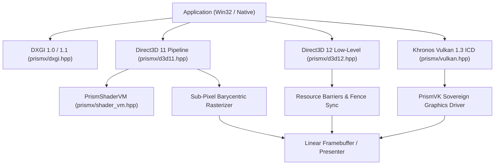

# PrismX Architecture Specification

## Sovereign Clean-Room Graphics Subsystem in ISO C++23

PrismX is an independent, sovereign graphics architecture engineered to provide unified DirectX and Vulkan compatibility with zero external runtime dependencies. Named in tribute to Dave Cutler's 1988 DEC PRISM RISC project, PrismX implements presentation infrastructure, low-level command queues, programmable shader bytecode execution, and hardware/software rasterization.

---

## 1. Architectural Layers

---

## 2. Core Subsystems

### 2.1 DXGI Infrastructure (`prismx/dxgi.hpp`)
- **Factory**: `CreateDXGIFactory`, `CreateDXGIFactory1`, `IDXGIFactory1`
- **Adapters**: Hardware accelerated and WARP software rasterizer adapters
- **Display Outputs**: Mode enumerations (1080p, 720p, 768p) and VBlank synchronization
- **Swap Chains**: Double and triple buffering with flip discard and sequential presentation models (`DXGI_SWAP_EFFECT_FLIP_DISCARD`)

### 2.2 Direct3D 11 Immediate Pipeline (`prismx/d3d11.hpp`)
- **Device & Immediate Context**: Buffer lifecycle, Viewports, Scissor testing
- **3D Mathematics**: `Vec3`, `Vec4`, `Mat4x4`, `MatrixMultiply`, `MatrixTranspose`, `MatrixPerspectiveFovLH`, `MatrixLookAtLH`, `MatrixRotationX/Y/Z`, `MatrixTranslation`
- **Software Rasterizer**: Sub-pixel precision (16.16 fixed point edge equations), perspective-correct barycentric interpolation, depth testing (Z-buffer), wireframe & solid fill modes, indexed primitives (`DrawIndexed`)

### 2.3 Direct3D 12 Low-Level Architecture (`prismx/d3d12.hpp`)
- **Explicit GPU Control**: `ID3D12Device`, `ID3D12CommandQueue`, `ID3D12CommandAllocator`, `ID3D12GraphicsCommandList`
- **Pipeline States**: `ID3D12PipelineState` (PSO), Root Signatures (`ID3D12RootSignature`)
- **Resource Management**: Committed resources, descriptor heaps (`CBV_SRV_UAV`, `RTV`, `DSV`), subresource states
- **Barrier Transitions**: Explicit synchronization (`D3D12_RESOURCE_BARRIER_TYPE_TRANSITION`, `PRESENT` -> `RENDER_TARGET` -> `PRESENT`)
- **Fence Synchronization**: GPU/CPU asynchronous timeline fences (`Signal`, `GetCompletedValue`, `SetEventOnCompletion`)

### 2.4 PrismShaderVM (`prismx/shader_vm.hpp`)
- **RISC SIMD Execution Engine**: 16 opcodes operating on 4-component single-precision floating point vectors (`float4`)
- **Opcodes**: `OP_MOV`, `OP_ADD`, `OP_SUB`, `OP_MUL`, `OP_MAD`, `OP_DP3`, `OP_DP4`, `OP_MIN`, `OP_MAX`, `OP_SLT`, `OP_SGE`, `OP_RCP`, `OP_RSQ`, `OP_CLAMP`, `OP_TEX`, `OP_RET`
- **Register Architecture**:
  - `r0` - `r7`: Temporary working registers
  - `v0` - `v3`: Input vertex attributes (Position, Color, UV, Normal)
  - `c0` - `c15`: Constant buffer parameters (MVP matrix, Light direction, Material colors)
  - `o0` - `o1`: Output attributes (Clip position, Shaded color)
- **Built-in Shaders**: MVP Matrix Transform Vertex Shader, Texture Modulation Pixel Shader, Directional Lambertian Lighting Pixel Shader

### 2.5 Vulkan 1.3 ICD Loader & PrismVK (`prismx/vulkan.hpp`)
- **ICD Architecture**: Standard Khronos dispatch tables (`vkGetInstanceProcAddr`, `vkGetDeviceProcAddr`)
- **Driver Discovery**: Registry and filesystem ICD manifest resolution
- **Core Entities**: `VkInstance`, `VkPhysicalDevice`, `VkDevice`, `VkQueue`, `VkCommandBuffer`, `VkRenderPass`, `VkFramebuffer`, `VkSwapchainKHR`
- **PrismVK**: Sovereign software graphics driver implementing physical device properties, memory types, and command buffer submission

---

## 3. Clean-Room & Footprint Guarantees

1. **Zero External Dependencies**: Compiles directly with standard ISO C++23 (`<vector>`, `<string>`, `<memory>`, `<atomic>`, `<cmath>`, `<cstring>`).
2. **Deterministic Memory Footprint**: Less than 64KB for the header interface; zero runtime dynamic overhead beyond user allocations.
3. **No Telemetry**: No background telemetry threads, no cloud analytics, no phoning home.
